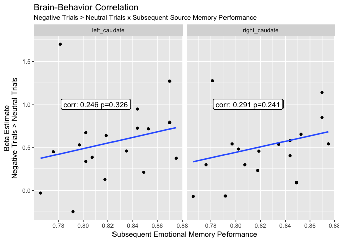

R Notebook
================

Load it up
==========

``` r
datapath  <- '~/Desktop/behavior/'
datafiles <- list.files(datapath, pattern='.*EmoRet.*\\.csv', 
                        full.names=TRUE, 
                        recursive=TRUE)
df.behav        <- do.call(rbind, lapply(datafiles, read.csv))
```

``` r
datapath  <- '~/Desktop/ER_SubEmoMemParMod/OneSampleTs18/0005_Emotional-Trials_vs_Neutral-Trials/'
(df.roi    <- read.csv(paste0(datapath, 'roi-data.csv')))
```

    ##    left_caudate right_caudate subjects
    ## 1    0.71695265    0.65376109 sub-s003
    ## 2    0.45666233    0.53449553 sub-s004
    ## 3   -0.03018617   -0.06971544 sub-s007
    ## 4    0.44848219    0.29502779 sub-s011
    ## 5    0.63777873    0.45522347 sub-s014
    ## 6    0.78870985    0.84382200 sub-s015
    ## 7    0.67103338    1.01050282 sub-s016
    ## 8    1.27012247    1.13712668 sub-s017
    ## 9    0.52852783    0.53967142 sub-s020
    ## 10   0.20747532    0.08997014 sub-s023
    ## 11   1.69702268    1.27489567 sub-s024
    ## 12   0.94283515    0.57766145 sub-s025
    ## 13   0.37254971    0.54042631 sub-s026
    ## 14   0.33441587    0.47989511 sub-s027
    ## 15  -0.24905718   -0.06473824 sub-s028
    ## 16   0.72420204    0.40102786 sub-s029
    ## 17   0.12348583    0.22828257 sub-s030
    ## 18   0.38386343    0.29500505 sub-s031

Calculate Memory Performance
============================

``` r
# extract subjectIDs from the files names and add them as a factor column of `df`
matches           <- regexpr ('sub-s[0-9]{3}', datafiles, perl = T)
subjectIDs        <- regmatches(datafiles, matches)
lengths           <- lapply(lapply(datafiles, read.csv), nrow)
df.behav$subjects <- factor(rep(subjectIDs, each = unique(lengths)))
```

``` r
(df.behav %>%
  group_by(subjects) %>%
  summarize(emo_source_memory_performance = mean(EmoAccuracy)) -> df.behav)
```

    ## # A tibble: 30 x 2
    ##    subjects emo_source_memory_performance
    ##      <fctr>                         <dbl>
    ##  1 sub-s002                     0.8229167
    ##  2 sub-s003                     0.8526786
    ##  3 sub-s004                     0.8348214
    ##  4 sub-s005                     0.7812500
    ##  5 sub-s006                     0.7656250
    ##  6 sub-s007                     0.7656250
    ##  7 sub-s008                     0.8072917
    ##  8 sub-s009                     0.8177083
    ##  9 sub-s010                     0.8385417
    ## 10 sub-s011                     0.7760417
    ## # ... with 20 more rows

Brain-Behavior Relation
=======================

``` r
(left_join(df.roi, df.behav, by = "subjects") %>%
  select(one_of(c("subjects", "left_caudate", "right_caudate", "emo_source_memory_performance"))) %>%
  mutate(subjects = factor(subjects)) %>%
  gather("roi", "negative_>_neutral", left_caudate, right_caudate) %>%
  mutate(roi = factor(roi)) -> df.brain.behavior)
```

    ## Warning: Column `subjects` joining factors with different levels, coercing
    ## to character vector

    ## Warning: package 'bindrcpp' was built under R version 3.3.2

    ##    subjects emo_source_memory_performance           roi negative_>_neutral
    ## 1  sub-s003                     0.8526786  left_caudate         0.71695265
    ## 2  sub-s004                     0.8348214  left_caudate         0.45666233
    ## 3  sub-s007                     0.7656250  left_caudate        -0.03018617
    ## 4  sub-s011                     0.7760417  left_caudate         0.44848219
    ## 5  sub-s014                     0.8187500  left_caudate         0.63777873
    ## 6  sub-s015                     0.8697917  left_caudate         0.78870985
    ## 7  sub-s016                     0.8020833  left_caudate         0.67103338
    ## 8  sub-s017                     0.8697917  left_caudate         1.27012247
    ## 9  sub-s020                     0.7968750  left_caudate         0.52852783
    ## 10 sub-s023                     0.8489583  left_caudate         0.20747532
    ## 11 sub-s024                     0.7812500  left_caudate         1.69702268
    ## 12 sub-s025                     0.8437500  left_caudate         0.94283515
    ## 13 sub-s026                     0.8750000  left_caudate         0.37254971
    ## 14 sub-s027                     0.8020833  left_caudate         0.33441587
    ## 15 sub-s028                     0.7916667  left_caudate        -0.24905718
    ## 16 sub-s029                     0.8437500  left_caudate         0.72420204
    ## 17 sub-s030                     0.8177083  left_caudate         0.12348583
    ## 18 sub-s031                     0.8072917  left_caudate         0.38386343
    ## 19 sub-s003                     0.8526786 right_caudate         0.65376109
    ## 20 sub-s004                     0.8348214 right_caudate         0.53449553
    ## 21 sub-s007                     0.7656250 right_caudate        -0.06971544
    ## 22 sub-s011                     0.7760417 right_caudate         0.29502779
    ## 23 sub-s014                     0.8187500 right_caudate         0.45522347
    ## 24 sub-s015                     0.8697917 right_caudate         0.84382200
    ## 25 sub-s016                     0.8020833 right_caudate         1.01050282
    ## 26 sub-s017                     0.8697917 right_caudate         1.13712668
    ## 27 sub-s020                     0.7968750 right_caudate         0.53967142
    ## 28 sub-s023                     0.8489583 right_caudate         0.08997014
    ## 29 sub-s024                     0.7812500 right_caudate         1.27489567
    ## 30 sub-s025                     0.8437500 right_caudate         0.57766145
    ## 31 sub-s026                     0.8750000 right_caudate         0.54042631
    ## 32 sub-s027                     0.8020833 right_caudate         0.47989511
    ## 33 sub-s028                     0.7916667 right_caudate        -0.06473824
    ## 34 sub-s029                     0.8437500 right_caudate         0.40102786
    ## 35 sub-s030                     0.8177083 right_caudate         0.22828257
    ## 36 sub-s031                     0.8072917 right_caudate         0.29500505

``` r
# left caudate
bv <- df.brain.behavior$roi  == "left_caudate"
left_caudate.test <- cor.test(df.brain.behavior$emo_source_memory_performance[bv],
                              df.brain.behavior$`negative_>_neutral`[bv])
# right caudate
bv <- df.brain.behavior$roi  == "right_caudate"
right_caudate.test <- cor.test(df.brain.behavior$emo_source_memory_performance[bv],
                              df.brain.behavior$`negative_>_neutral`[bv])

df.brain.behavior %>%
  group_by(roi) %>%
  mutate(cor = as.character(round(ifelse(roi == "left_caudate", left_caudate.test$estimate[[1]], 
                      ifelse(roi == "right_caudate", right_caudate.test$estimate[[1]], NA)), 3)),
         p.value = as.character(round(ifelse(roi == "left_caudate", left_caudate.test$p.value[[1]], 
                      ifelse(roi == "right_caudate", right_caudate.test$p.value[[1]], NA)), 3))
         ) -> df.brain.behavior

df.brain.behavior %>%
  ggplot(aes(x = emo_source_memory_performance, y = `negative_>_neutral`)) + 
  geom_point() + 
  geom_smooth(method='lm', se = FALSE) + 
  geom_label(aes(x = .81, y = 1, label = paste0("corr: ", cor, " p=", p.value))) + 
  facet_grid(~roi) + 
  ggtitle("Brain-Behavior Correlation", 
          subtitle = "Negative Trials > Neutral Trials x Subsequent Source Memory Performance") + 
  ylab("Beta Estimate\nNegative Trials > Neutral Trials") + 
  xlab("Subsequent Emotional Memory Peformance")
```


